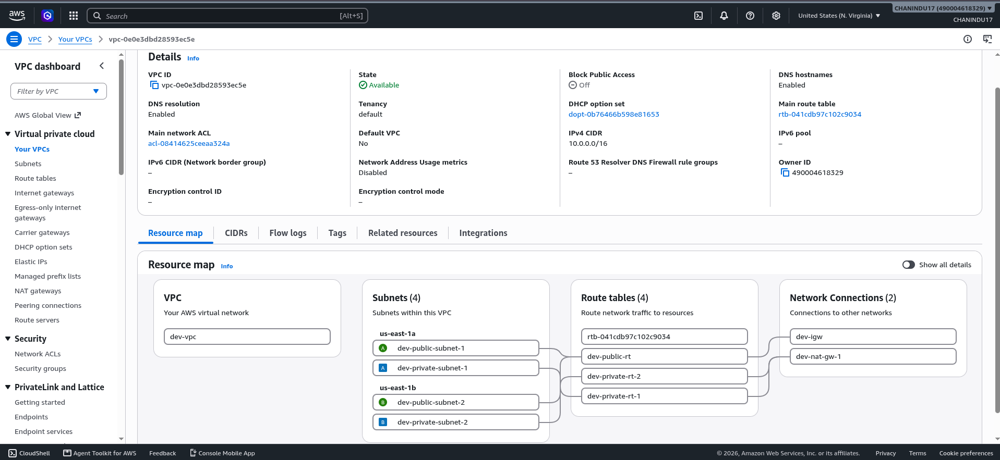
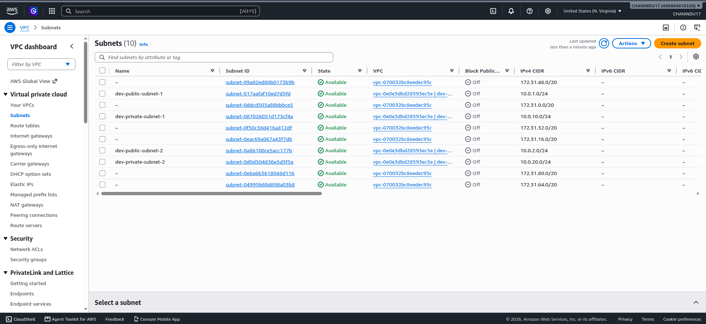
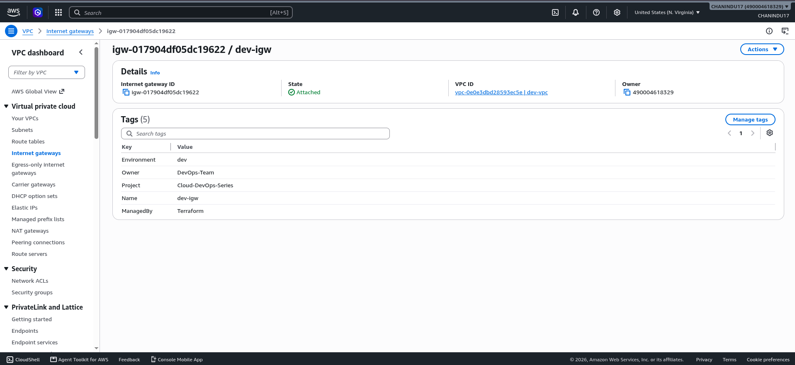
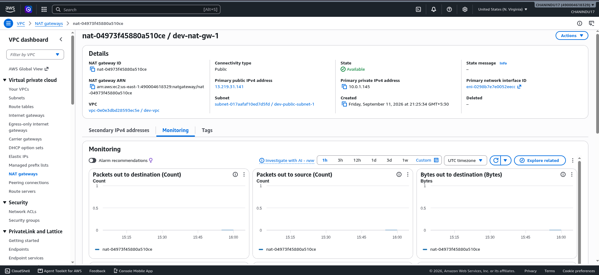

# Production-Ready AWS VPC Infrastructure with Terraform, DevSecOps & GitHub Actions CI/CD

[](https://github.com/ChaninduImanjith/aws-vpc-terraform/actions/workflows/terraform.yml)
[](https://www.terraform.io/)
[](https://aws.amazon.com/vpc/)
[](https://github.com/aquasecurity/tfsec)
[](LICENSE)

A production-grade, highly available, and cost-optimized **AWS Virtual Private Cloud (VPC)** infrastructure built with **Terraform** and automated using **GitHub Actions CI/CD**.

This repository demonstrates **Infrastructure as Code (IaC)**, **GitOps**, and **DevSecOps** best practices, including:

- Dynamic multi-AZ subnet provisioning
- Public and private subnet separation
- Automated route management
- Configurable NAT Gateway deployment
- AWS EKS-ready subnet tagging
- Remote Terraform state using Amazon S3
- Terraform state locking using DynamoDB
- Static Terraform security scanning using `tfsec`
- Automated validation, planning, and deployment using GitHub Actions
- Reusable Terraform module architecture

---

## Architecture Overview

The infrastructure provisions an isolated AWS network across multiple Availability Zones in the `us-east-1` region.

### Network Configuration

| Resource | Configuration |
|---|---|
| **VPC CIDR** | `10.0.0.0/16` |
| **Availability Zones** | `us-east-1a`, `us-east-1b` |
| **Public Subnet 1** | `10.0.1.0/24` |
| **Public Subnet 2** | `10.0.2.0/24` |
| **Private Subnet 1** | `10.0.10.0/24` |
| **Private Subnet 2** | `10.0.20.0/24` |
| **Internet Access** | Internet Gateway |
| **Private Egress** | NAT Gateway |
| **Remote State** | Amazon S3 |
| **State Locking** | Amazon DynamoDB |
| **Security Scanning** | tfsec |
| **CI/CD** | GitHub Actions |

### Public Subnets

Public subnets are connected to an **Internet Gateway (IGW)** and can host internet-facing resources such as:

- Application Load Balancers
- Bastion hosts
- Public-facing services

### Private Subnets

Private subnets do not receive direct inbound internet access.

Outbound internet access is routed through a **NAT Gateway**, allowing private resources to securely access package repositories, APIs, and external services.

### High Availability & Cost Optimization

The module supports configurable NAT Gateway deployment strategies:

- **Single NAT Gateway** for development environments to reduce infrastructure cost.
- **One NAT Gateway per Availability Zone** for production environments requiring higher availability.

### Kubernetes / EKS Integration

Public and private subnets include standard AWS EKS subnet tags:

```text
kubernetes.io/role/elb
kubernetes.io/role/internal-elb
```

These tags allow AWS Load Balancer integrations to automatically identify the appropriate subnets.

### DevSecOps Security Integration

Terraform code is statically analyzed using **tfsec** before infrastructure changes are deployed.

The security scan is integrated directly into the GitHub Actions CI/CD pipeline to identify insecure infrastructure configurations early in the development lifecycle.

---

## Network Architecture

```text
                         Internet
                            │
                            ▼
                   ┌─────────────────┐
                   │ Internet Gateway│
                   └────────┬────────┘
                            │
              ┌─────────────┴─────────────┐
              │                           │
              ▼                           ▼
     ┌─────────────────┐         ┌─────────────────┐
     │ Public Subnet A │         │ Public Subnet B │
     │  10.0.1.0/24    │         │  10.0.2.0/24    │
     │   us-east-1a    │         │   us-east-1b    │
     └────────┬────────┘         └─────────────────┘
              │
              ▼
       ┌─────────────┐
       │ NAT Gateway │
       └──────┬──────┘
              │
       ┌──────┴─────────────────────────┐
       │                                │
       ▼                                ▼
┌─────────────────┐            ┌─────────────────┐
│ Private Subnet A│            │ Private Subnet B│
│ 10.0.10.0/24    │            │ 10.0.20.0/24    │
│  us-east-1a     │            │  us-east-1b     │
└─────────────────┘            └─────────────────┘
```

---

## DevSecOps CI/CD Pipeline Architecture

```text
Developer
    │
    │ Push / Pull Request
    ▼
GitHub Repository
    │
    ▼
GitHub Actions Runner
    │
    ├─────────────────────────────┐
    │                             │
    ▼                             ▼
Pull Request                  Push / Merge to main
    │                             │
    ├─ terraform fmt              ├─ terraform fmt
    ├─ terraform init             ├─ terraform init
    ├─ terraform validate         ├─ terraform validate
    ├─ tfsec security scan        ├─ tfsec security scan
    └─ terraform plan             ├─ terraform plan
                                  └─ terraform apply
                                         │
                                         ▼
                                  AWS Infrastructure
```

### Pull Request Workflow

When a Pull Request is opened or updated, GitHub Actions automatically executes:

```bash
terraform fmt -check -recursive
terraform init
terraform validate
tfsec .
terraform plan
```

This ensures that infrastructure changes are:

- Properly formatted
- Syntactically valid
- Security scanned
- Reviewable before deployment

### Main Branch Deployment Workflow

After a Pull Request is approved and merged into `main`, GitHub Actions executes:

```bash
terraform init
terraform validate
tfsec .
terraform plan
terraform apply -auto-approve
```

This automatically provisions or updates the AWS infrastructure.

---

## Remote Terraform State

Terraform state is stored remotely using **Amazon S3**.

Example backend configuration:

```hcl
terraform {
  backend "s3" {
    bucket         = "your-terraform-state-bucket"
    key            = "dev/vpc/terraform.tfstate"
    region         = "us-east-1"
    dynamodb_table = "terraform-state-lock"
    encrypt        = true
  }
}
```

### Benefits

Remote state provides:

- Centralized state management
- Team collaboration
- State persistence
- Protection against local state loss
- Encrypted state storage
- State locking during concurrent Terraform operations

DynamoDB locking prevents multiple Terraform executions from modifying the same state simultaneously.

> Replace the example S3 bucket and DynamoDB table names with the resources configured for your environment.

---

## AWS Deployment Verification

The following screenshots verify that the infrastructure was successfully provisioned in AWS.

### 1. VPC Resource Map & Network Topology

Visual representation of the created `dev-vpc`, subnets, route tables, Internet Gateway, and NAT Gateway.



### 2. Multi-AZ Subnet Allocation

Public and private subnets distributed across `us-east-1a` and `us-east-1b`.



### 3. Internet Gateway Configuration

Internet Gateway attached to `dev-vpc` with standardized resource tags.



### 4. NAT Gateway Provisioning

Cost-optimized NAT Gateway deployed inside a public subnet to provide outbound internet connectivity for private subnets.



---

## Project Structure

```text
aws-vpc-terraform/
│
├── .github/
│   └── workflows/
│       └── terraform.yml
│
├── docs/
│   └── screenshots/
│       ├── vpc-resource-map.png
│       ├── subnets-list.png
│       ├── internet-gateway.png
│       └── nat-gateway.png
│
├── modules/
│   └── vpc/
│       ├── main.tf
│       ├── outputs.tf
│       └── variables.tf
│
├── environments/
│   └── dev/
│       ├── backend.tf
│       ├── main.tf
│       ├── outputs.tf
│       ├── providers.tf
│       ├── terraform.tfvars
│       └── variables.tf
│
├── .gitignore
└── README.md
```

### Directory Responsibilities

**`.github/workflows/`**

Contains the GitHub Actions workflow responsible for Terraform validation, security scanning, planning, and deployment.

**`modules/vpc/`**

Contains the reusable VPC Terraform module.

**`environments/dev/`**

Contains development environment configuration and module invocation.

**`docs/screenshots/`**

Contains AWS Console screenshots used for infrastructure verification.

---

## Getting Started

### Prerequisites

Before using this project, install and configure:

- [Terraform](https://developer.hashicorp.com/terraform/install) `>= 1.5.0`
- [AWS CLI v2](https://docs.aws.amazon.com/cli/latest/userguide/getting-started-install.html)
- Git
- `tfsec`
- An AWS account with permissions to create networking resources
- An Amazon S3 bucket for Terraform remote state
- A DynamoDB table for Terraform state locking

---

## AWS CLI Configuration

For local Terraform execution, configure AWS credentials:

```bash
aws configure
```

You will be prompted for:

```text
AWS Access Key ID
AWS Secret Access Key
Default region name
Default output format
```

Example region:

```text
us-east-1
```

Verify authentication:

```bash
aws sts get-caller-identity
```

---

## GitHub Actions AWS Credentials

For CI/CD deployment, configure the following GitHub Repository Secrets:

```text
AWS_ACCESS_KEY_ID
AWS_SECRET_ACCESS_KEY
```

Navigate to:

```text
GitHub Repository
    → Settings
    → Secrets and variables
    → Actions
    → New repository secret
```

Add the required AWS credentials.

> For production environments, GitHub Actions with AWS IAM OpenID Connect (OIDC) is preferred over long-lived AWS access keys.

---

## Deployment Steps

### 1. Clone the Repository

```bash
git clone https://github.com/ChaninduImanjith/aws-vpc-terraform.git
cd aws-vpc-terraform
```

### 2. Navigate to the Development Environment

```bash
cd environments/dev
```

### 3. Initialize Terraform

```bash
terraform init
```

### 4. Format Terraform Code

```bash
terraform fmt -recursive
```

Check formatting without modifying files:

```bash
terraform fmt -check -recursive
```

### 5. Validate Configuration

```bash
terraform validate
```

### 6. Run Security Scan

```bash
tfsec .
```

### 7. Preview Infrastructure Changes

```bash
terraform plan
```

Review all proposed changes before applying them.

### 8. Apply Configuration Locally

```bash
terraform apply
```

Or:

```bash
terraform apply -auto-approve
```

For normal GitOps workflows, deployment should occur through GitHub Actions after merging changes into `main`.

---

## Automated Pipeline Deployment

### 1. Create a Feature Branch

```bash
git checkout -b feature/network-update
```

### 2. Make Infrastructure Changes

Modify the required Terraform configuration.

### 3. Format, Validate & Scan Locally

```bash
terraform fmt -recursive
terraform validate
tfsec .
terraform plan
```

### 4. Commit the Changes

```bash
git add .
git commit -m "Update network configuration"
```

### 5. Push the Feature Branch

```bash
git push origin feature/network-update
```

### 6. Open a Pull Request

Create a Pull Request from:

```text
feature/network-update
        ↓
      main
```

GitHub Actions will automatically run:

```text
terraform fmt
terraform init
terraform validate
tfsec security scan
terraform plan
```

### 7. Merge the Pull Request

After reviewing:

- Terraform code
- tfsec security results
- Terraform execution plan
- GitHub Actions status

merge the Pull Request.

The deployment workflow will then execute Terraform against AWS.

---

## Destroying Infrastructure

To remove the provisioned infrastructure manually:

```bash
cd environments/dev
terraform destroy
```

Or:

```bash
terraform destroy -auto-approve
```

> Always review destroy plans carefully before approving them, especially in shared or production environments.

---

## Module Inputs

| Name | Description | Type | Default | Required |
|---|---|---|---|---|
| `vpc_cidr` | Base CIDR block for the VPC | `string` | `"10.0.0.0/16"` | Yes |
| `public_subnet_cidrs` | CIDR blocks for public subnets | `list(string)` | `["10.0.1.0/24", "10.0.2.0/24"]` | Yes |
| `private_subnet_cidrs` | CIDR blocks for private subnets | `list(string)` | `["10.0.10.0/24", "10.0.20.0/24"]` | Yes |
| `enable_single_nat_gateway` | Use a single NAT Gateway for cost optimization | `bool` | `true` | No |

---

## Module Outputs

| Name | Description |
|---|---|
| `vpc_id` | ID of the created AWS VPC |
| `public_subnet_ids` | List of public subnet IDs |
| `private_subnet_ids` | List of private subnet IDs |
| `nat_gateway_ips` | Public Elastic IP addresses assigned to NAT Gateways |

Example:

```bash
terraform output
```

Possible output:

```text
vpc_id = "vpc-xxxxxxxxxxxxxxxxx"

public_subnet_ids = [
  "subnet-xxxxxxxxxxxxxxxxx",
  "subnet-yyyyyyyyyyyyyyyyy"
]

private_subnet_ids = [
  "subnet-aaaaaaaaaaaaaaaaa",
  "subnet-bbbbbbbbbbbbbbbbb"
]
```

---

## Key Features

- Multi-AZ AWS VPC architecture
- Reusable Terraform module design
- Public and private subnet isolation
- Dynamic subnet provisioning
- Internet Gateway configuration
- NAT Gateway private subnet egress
- Single NAT Gateway cost-optimization mode
- Multi-NAT production deployment support
- Automatic route table creation
- Automatic route table associations
- Elastic IP management
- AWS EKS-ready subnet tagging
- Consistent AWS resource tagging
- Environment-specific Terraform configuration
- Amazon S3 remote Terraform state
- DynamoDB Terraform state locking
- Static Terraform security scanning using `tfsec`
- DevSecOps security checks inside CI/CD
- GitHub Actions CI/CD automation
- Pull Request Terraform validation
- Automated Terraform planning
- Automated infrastructure deployment
- GitOps-style infrastructure workflow

---

## DevSecOps Security Scanning

Security validation is integrated directly into the infrastructure delivery workflow using **tfsec**.

`tfsec` performs static analysis on Terraform configuration and can detect issues such as:

- Publicly exposed infrastructure
- Overly permissive network rules
- Missing encryption
- Insecure AWS service configurations
- Weak security defaults
- Misconfigured cloud resources

Run the scan locally:

```bash
tfsec .
```

The same security scan also runs automatically inside GitHub Actions.

If the security scan fails, the CI/CD workflow can stop before insecure infrastructure changes are deployed.

---

## Security & Networking Notes

### Private Subnet Isolation

Private subnets do not expose resources directly to the public internet.

Outbound traffic follows:

```text
Private Resource
      │
      ▼
Private Route Table
      │
      ▼
NAT Gateway
      │
      ▼
Internet Gateway
      │
      ▼
Internet
```

### Remote State Security

Terraform state is stored remotely in Amazon S3 with encryption enabled:

```hcl
encrypt = true
```

Production environments should additionally consider:

- S3 bucket versioning
- S3 public access blocking
- Restricted IAM access
- Server-side encryption using AWS KMS
- CloudTrail logging
- State backup and recovery policies

### State Locking

DynamoDB state locking protects against concurrent Terraform executions that could otherwise corrupt infrastructure state.

### AWS Credentials

GitHub Actions credentials should follow the **principle of least privilege**.

For production environments, prefer short-lived AWS credentials through **GitHub Actions OIDC federation** instead of storing long-lived IAM access keys.

### NAT Gateway Availability

A single NAT Gateway reduces development cost but introduces an availability dependency.

For production workloads, deploying one NAT Gateway per Availability Zone provides better fault isolation.

---

## Terraform Workflow

Recommended local development workflow:

```bash
terraform fmt -recursive
terraform init
terraform validate
tfsec .
terraform plan
```

Recommended deployment workflow:

```text
Developer
   │
   ▼
Feature Branch
   │
   ▼
Pull Request
   │
   ▼
Terraform Formatting
   │
   ▼
Terraform Validation
   │
   ▼
tfsec Security Scan
   │
   ▼
Terraform Plan
   │
   ▼
Code Review
   │
   ▼
Merge to main
   │
   ▼
Terraform Apply
   │
   ▼
AWS Infrastructure
```

---

## Screenshots

AWS verification screenshots should be stored in:

```text
docs/screenshots/
```

Expected files:

```text
vpc-resource-map.png
subnets-list.png
internet-gateway.png
nat-gateway.png
```

If the filenames are changed, update the corresponding image paths in this README.

---

## Future Improvements

Potential improvements for production environments include:

- GitHub Actions authentication using AWS OIDC
- Separate `dev`, `staging`, and `prod` environments
- GitHub Environment approval gates for production
- TFLint integration
- Checkov security scanning
- Amazon VPC Flow Logs
- VPC Endpoints for private AWS service access
- AWS KMS encryption for remote state
- Network ACL customization
- AWS Transit Gateway integration
- Automated Terraform documentation
- Automated semantic versioning
- Infrastructure testing
- Cost estimation during Pull Requests
- Automated security reporting

---

## Repository

GitHub:

```text
https://github.com/ChaninduImanjith/aws-vpc-terraform
```

Clone:

```bash
git clone https://github.com/ChaninduImanjith/aws-vpc-terraform.git
```

---
<!-- Documentation update -->


## License

This project is licensed under the **MIT License**.

See the [LICENSE](LICENSE) file for details.
